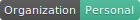
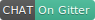
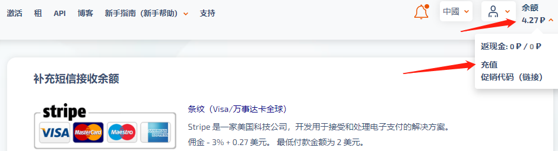
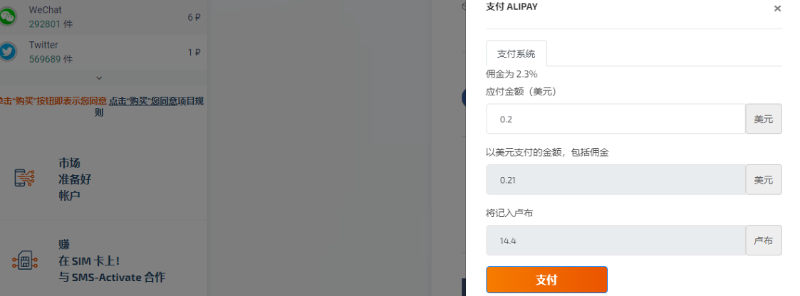
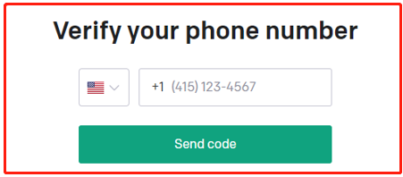
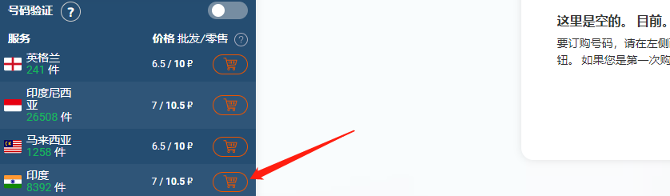
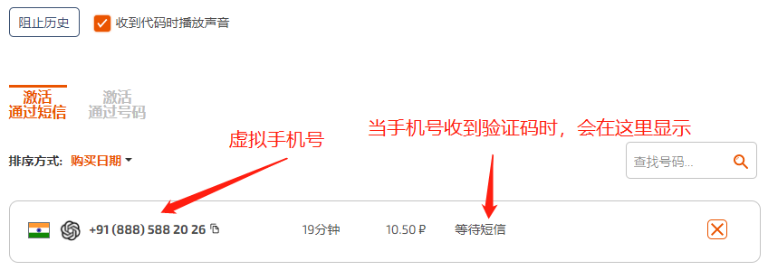
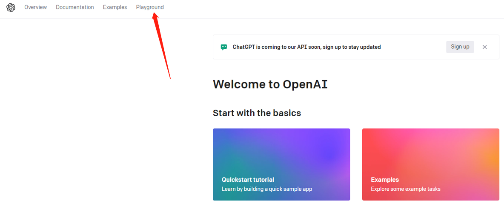

# chatGPT

[]() []() []() [](https://gitter.im/leaveking/xunsi-note) []() 

---

# 注册体验

当前chatGPT无法直接使用大陆、香港、澳门的IP直接访问，需要使用欧美、印度、印尼等地区的IP访问。

## 虚拟手机号

注册时，需要使用一个国外的虚拟手机号，来完成 **验证码** 的接收。提供虚拟手机号服务的服务商很多，这里我使用 [sms-activate](https://sms-activate.org/buy) 服务商，提供 **国外虚拟手机号接收验证码**：



接着，充值 `0.2美元(约1.4块钱人民币)` ：



## 科学上网

将科学上网工具，请设置为全局模式。此外，机场节点推荐选择美国（当前不支持香港，请勿选择）。此外，当你所有流程都没有问题，但依然访问不了时，请适当切换节点。

## 登录OpenAI注册

### 浏览器窗口

请使用 **浏览器隐私模式**，打开浏览器窗口，并在浏览器中按下 `F12键`，以此打开浏览器的console控制台，在console中输入如下指令，并回车：

```bash
window.localStorage.removeItem(Object.keys(window.localStorage).find(i=>i.startsWith('@@auth0spajs')))
```

然后在该浏览器窗口中，访问 [chatGPT注册页面](https://beta.openai.com/signup) （注意，一定要用隐私模式，也叫做无痕窗口，不然很容易被识别到你所处的地区为中国，导致注册失败）:

```http
https://beta.openai.com/signup
```

### 注册过程

使用你自己的邮箱注册即可，当弹出如下界面时，要求你填写一个手机号，用于接收验证码：



需要使用国外的手机号，这里我选择印度的手机号（因为便宜，才几毛钱），在刚才注册的  [sms-activate](https://sms-activate.org/buy) 虚拟手机号供应商中，选择 `OpenAI -> 印度` ，点击购物车购买即可：



这样，你就购买了一个虚拟手机号（只有20分钟，请尽快在20分钟内，完成注册）：



将手机号填入chatGPT注册页面（注意选择 `印度+91`） ，然后点击 `Send code` 完成注册即可。完成注册后，可以看到类似如下界面（Playground的适合程序员调试使用，普通用户体验，直接访问 `https://chat.openai.com/chat`）：



点击 `Playground` 就可以进行体验了。

